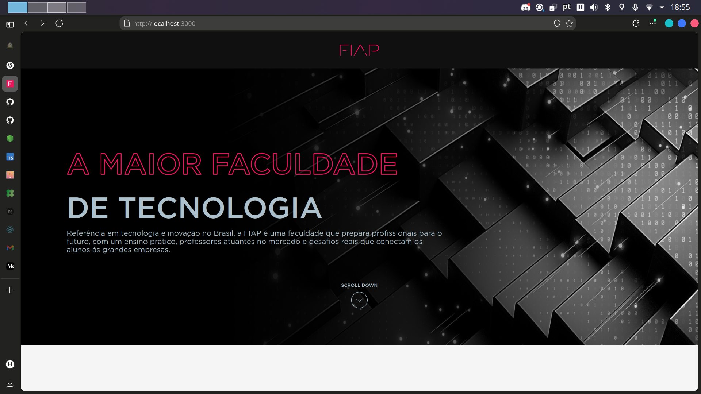
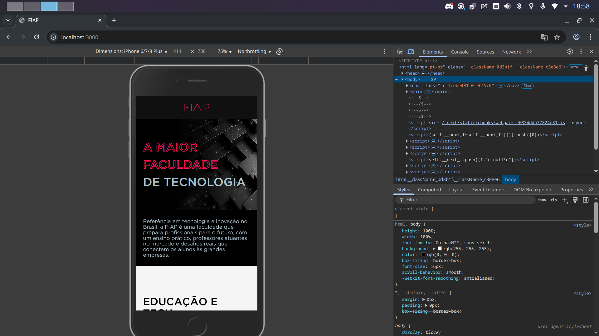

# FIAP

Projeto desenvolvido como desafio Front-End da FIAP.

### 🖼️ Preview

| Desktop | Mobile |
|--------|--------|
|  |  |


## 🧪 Tecnologias

Este projeto foi desenvolvido com as seguintes tecnologias:

- [React](https://react.dev)
- [Next.js](https://nextjs.org)
- [Styled-components](https://styled-components.com/)
- [GSAP](https://gsap.com)
- [TypeScript](https://www.typescriptlang.org)

## 💻 Requisitos

Antes de começar, verifique se você tem instalado:

- [Node.js](https://nodejs.org/) (recomendado: versão 18 ou superior)
- [Yarn](https://yarnpkg.com) ou [npm](https://www.npmjs.com/)

## 🚀 Como rodar o projeto

1. Clone o repositório:

```bash
git clone https://github.com/henriquesoubhia/fiap-project.git
```

2. Acesse a pasta do projeto:

```bash
cd fiap-project
```

3. Instale as dependências:

```bash
yarn install
# ou
npm install
```

4. Inicie o servidor de desenvolvimento:

```bash
yarn dev
# ou
npm run dev
```

5. Abra no navegador:

```
http://localhost:3000
```
